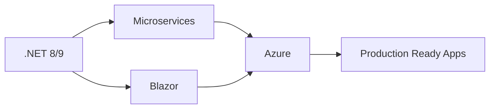

# 👋 Welcome! I'm Mostafa Mahmoud

<div align="center">
  
### Full Stack .NET Developer | Building Scalable Web Solutions

[](https://github.com/mostafa-m-hussein)
[](https://github.com/mostafa-m-hussein)

</div>

---

## 🚀 About Me

I'm a passionate Full Stack Developer specializing in the .NET ecosystem, dedicated to crafting robust, scalable, and efficient web applications. With a strong foundation in both frontend and backend technologies, I create seamless digital experiences from database to user interface.

- 🔭 Currently working on **enterprise-level .NET applications**
- 🌱 Deepening my expertise in **Microservices Architecture, Clean Architecture, and Cloud Technologies**
- 💡 Exploring **Blazor, MAUI, and modern frontend frameworks**
- 🎯 Focused on **performance optimization and best practices**
- 📫 Reach me at **mostafaasey25@gmail.com**

---

## 💻 Tech Stack

### Backend


### Frontend


### Databases


### Cloud & DevOps


### Tools & Practices


---

## 🏆 Core Competencies

```csharp
var skills = new Dictionary<string, List<string>>
{
    ["Architecture"] = new() { "RESTful APIs", "Microservices", "Clean Architecture", "CQRS", "DDD" },
    ["Backend"] = new() { "ASP.NET Core", "Entity Framework Core", "LINQ", "Web APIs", "SignalR" },
    ["Frontend"] = new() { "Blazor Server/WASM", "Razor Pages", "MVC", "JavaScript", "Responsive Design" },
    ["Database"] = new() { "SQL Server", "MongoDB", "Database Design", "Query Optimization" },
    ["DevOps"] = new() { "CI/CD", "Docker", "Azure DevOps", "GitHub Actions" },
    ["Best Practices"] = new() { "Unit Testing", "TDD", "Code Reviews", "SOLID Principles", "Security" }
};
```

---

## 📊 GitHub Statistics

<div align="center">
  


</div>

---

## 🏆 Achievements

<div align="center">

[](https://github.com/mostafa-m-hussein)

</div>

---

## 🤝 Connect With Me

<div align="center">

[](https://instagram.com/mustafa_m_hussein)
[](https://linkedin.com/in/mostafa-m-hussein)
[](https://codeforces.com/profile/mustafa_m_hussein)
[](mailto:mostafaasey25@gmail.com)

</div>

---

## 💼 What I'm Working With

- ⚡ Building **scalable backend systems** with ASP.NET Core
- 🎨 Creating **interactive UIs** with Blazor and modern JavaScript
- 🔐 Implementing **secure authentication** and authorization systems
- 📊 Designing **efficient database schemas** and optimizing queries
- ☁️ Deploying applications to **Azure Cloud**
- 🧪 Writing **comprehensive unit and integration tests**

---

## 📈 Current Focus



---

<div align="center">

### 💬 "Clean code always looks like it was written by someone who cares."

**Open to collaboration and exciting projects!**


</div>
